# Study Session: Understanding Cache Technologies with SimRV

**Target Audience:** Computer Architecture Students (Bachelors / Masters) & Systems Engineers  
**Duration:** 60 Minutes (Hands-on Interactive Lab) + Advanced Coherence Extension  
**Architecture Target:** RISC-V 32-bit (`RV32GC`)  
**Simulator Module:** `module load archlab/simrv` (`simrv` / `SimRV`)  

---

## Environment Setup & Module Loading

Before starting the exercises, load the SimRV module into your shell environment:

```bash
# Load the SimRV simulator module
module load archlab/simrv

# Verify installation
simrv --version
```

All pre-assembled binaries and workload sources are provided in `/mnt/archlab/study/cache/`.

---

## Session Overview & Schedule

Modern CPUs execute instructions orders of magnitude faster than main memory (DRAM) can deliver data—a phenomenon known as the *Memory Wall*. Caches bridge this latency gap by exploiting **temporal locality** and **spatial locality**. In multicore processors, private caches introduce the **cache coherence problem**, which hardware protocols (such as MESI) resolve.

This study session provides a direct, visual investigation into hardware cache mechanics using SimRV's cycle-accurate simulation engine and interactive terminal UI (TUI), accompanied by theoretical foundations in cache coherence for advanced computer architecture students.

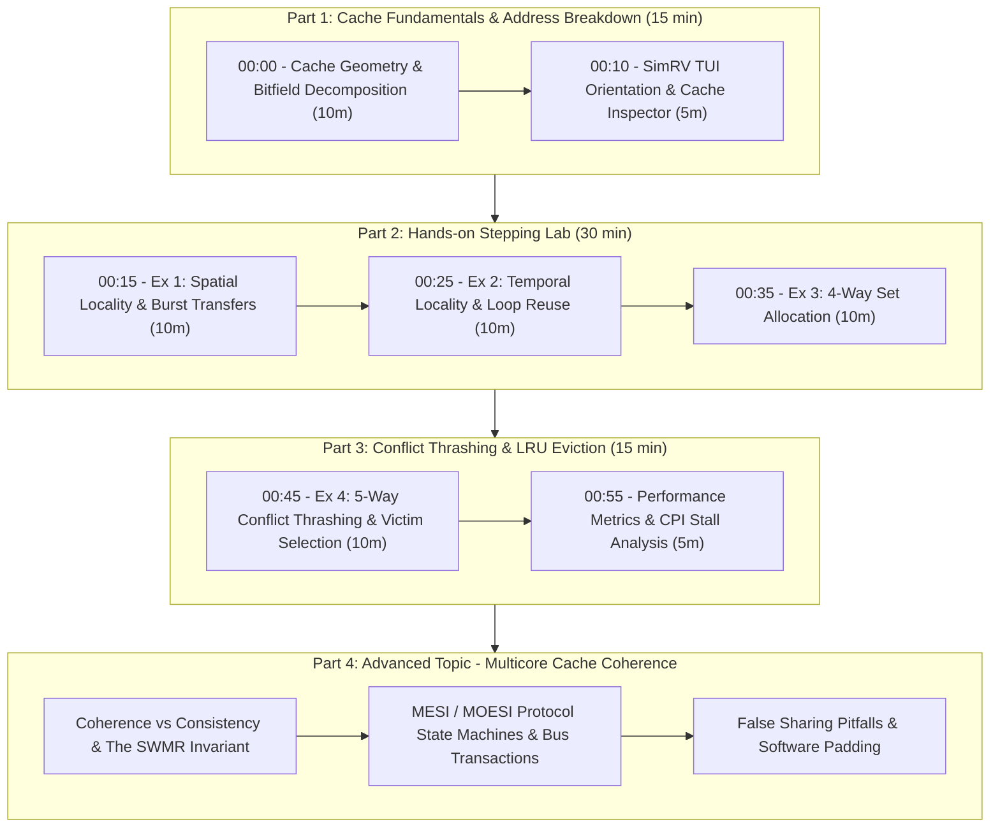

| Phase | Time | Topic / Activity | Key Takeaway |
| :--- | :--- | :--- | :--- |
| **Part 1** | 00:00 – 00:15 | Cache Architecture & Address Breakdown | Tag, Set Index, and Offset math in RV32 |
| **Part 2** | 00:15 – 00:45 | Hands-On Stepping: Locality Experiments | Compulsory vs Spatial vs Temporal hits |
| **Part 3** | 00:45 – 01:00 | 5-Way Conflict Thrashing & LRU Eviction | Set capacity limits, LRU, and stall overhead |
| **Part 4** | Advanced | Multicore Cache Coherence & MESI | Snooping, False Sharing, SWMR invariant |

---

## Part 1: Cache Architecture Fundamentals (15 min)

### 1.1 SimRV L1 Cache Geometry

SimRV implements separate L1 Instruction (`ICache`) and L1 Data (`DCache`) caches with the following microarchitectural parameters:

- **Total Cache Capacity:** $2048\text{ Bytes}\ (2\text{ KiB})$
- **Associativity:** $4\text{-way Set-Associative}\ (W = 4)$
- **Block / Line Size:** $32\text{ Bytes}\ (B = 32)$
- **Total Cache Lines:** $64\text{ Lines}$
- **Number of Sets ($S$):**
  $$\text{Sets} = \frac{\text{Total Lines}}{\text{Associativity}} = \frac{64}{4} = 16\text{ Sets}\ (S = 16)$$
- **Replacement Policy:** Least Recently Used (LRU) with exact 64-bit access timestamps.

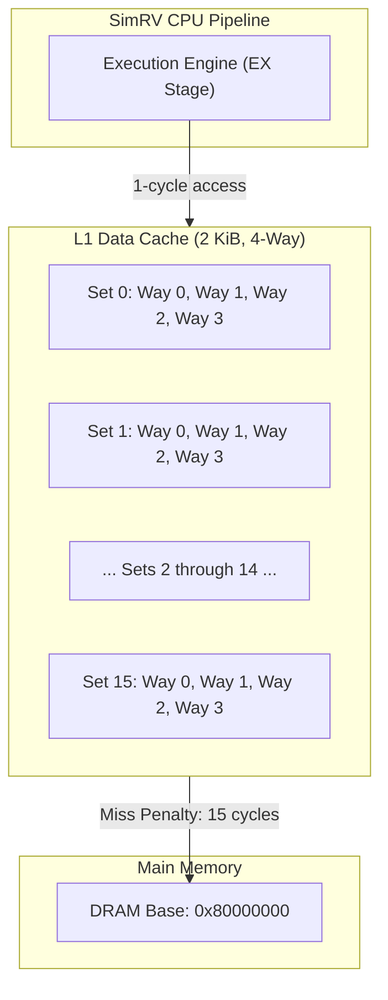

---

### 1.2 RV32 Address Decomposition

In a 32-bit physical address space, every memory reference address is divided into three distinct bitfields:

1. **Byte Offset ($b$ bits):** Selects the specific byte within a 32-byte cache line.
   $$b = \log_2(\text{LineBytes}) = \log_2(32) = 5\text{ bits}\quad (\text{Bits } [4:0])$$
2. **Set Index ($s$ bits):** Selects one of the 16 cache sets.
   $$s = \log_2(\text{NumSets}) = \log_2(16) = 4\text{ bits}\quad (\text{Bits } [8:5])$$
3. **Tag ($t$ bits):** Stored in the cache line to verify whether the cached line matches the requested address.
   $$t = 32 - (s + b) = 32 - (4 + 5) = 23\text{ bits}\quad (\text{Bits } [31:9])$$

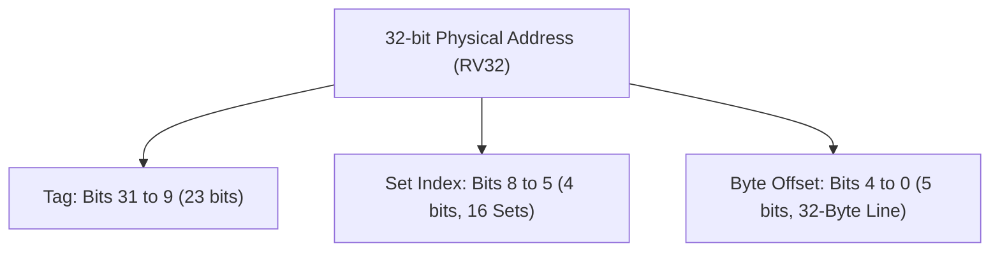

#### Address Breakdown Examples

| Physical Address | Binary (Bits 31..0) | Tag (Hex) | Set Index (Dec) | Offset (Hex) |
| :--- | :--- | :--- | :--- | :--- |
| `0x80001000` | `1000 0000 0000 0000 0001 0000 0000 0000` | `0x400008` | Set `0` (`0000`) | `0x00` (`00000`) |
| `0x80001004` | `1000 0000 0000 0000 0001 0000 0000 0100` | `0x400008` | Set `0` (`0000`) | `0x04` (`00100`) |
| `0x80001020` | `1000 0000 0000 0000 0001 0000 0010 0000` | `0x400008` | Set `1` (`0001`) | `0x00` (`00000`) |
| `0x80001200` | `1000 0000 0000 0000 0001 0010 0000 0000` | `0x400009` | Set `0` (`0000`) | `0x00` (`00000`) |

> [!TIP]
> **Set Stride Rule:** Addresses that differ by multiples of $16 \times 32\text{ bytes} = 512\text{ bytes}\ (0\times200)$ have identical set index bits (`[8:5] = 0000`) and map to the exact same cache set!

---

### 1.3 Cache Line Anatomy in SimRV

Each cache line in SimRV's `BaseCache.hpp` contains:

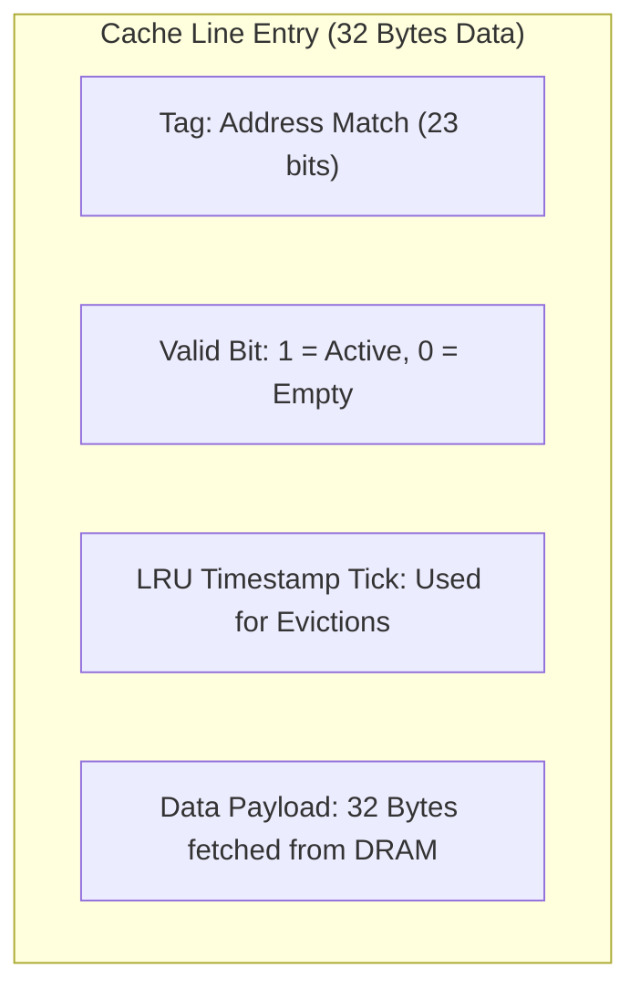

- `valid`: $1$ if the line holds active cached data, $0$ upon reset/flush.
- `tag`: Physical address identifier (matched on read/write).
- `last_used`: Monotonic timestamp tick used by the LRU arbiter to select eviction victims.
- `data`: 32-byte payload loaded from memory in a single burst on a miss.

---

### 1.4 SimRV TUI Cache Inspector Quickstart

Launch SimRV with `-C` (or `--cycle-accurate`) to enable full cache modeling:

```bash
simrv -m /mnt/archlab/study/cache/01_spatial_locality.bin -b -C
```

#### Key TUI Controls:
- `r`: Cycle left pane views until the **Cache Inspector** appears.
- `s` or `Space`: Single-step one instruction.
- `c`: Continue / Run continuously (press `p` to pause).
- `g`: Toggle Guided Inspection assistant ribbon.
- `q`: Quit simulation.

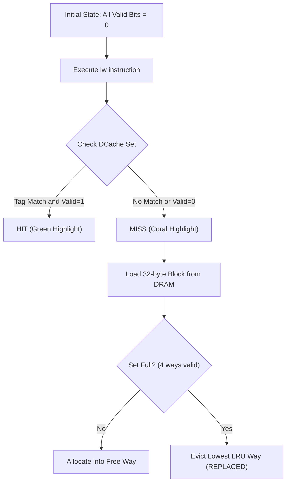

---

## Part 2: Hands-On Stepping Lab (30 min)

### Exercise 1: Compulsory Misses & Spatial Locality (10 min)

**Workload Source:** `/mnt/archlab/study/cache/01_spatial_locality.S`

```assembly
.section .text
.global _start
_start:
    la a0, test_data_buffer
    lw t0,  0(a0)    # Access offset +0  -> MISS (Cold / Compulsory)
    lw t1,  4(a0)    # Access offset +4  -> HIT  (Spatial Locality)
    lw t2,  8(a0)    # Access offset +8  -> HIT  (Spatial Locality)
    lw t3, 12(a0)    # Access offset +12 -> HIT  (Spatial Locality)
    lw t4, 16(a0)    # Access offset +16 -> HIT  (Spatial Locality)
    lw t5, 20(a0)    # Access offset +20 -> HIT  (Spatial Locality)
    lw t6, 24(a0)    # Access offset +24 -> HIT  (Spatial Locality)
    lw s1, 28(a0)    # Access offset +28 -> HIT  (Spatial Locality)

    # Next cache line (offset +32):
    lw s2, 32(a0)    # Access offset +32 -> MISS (Crosses 32-byte block)
    lw s3, 36(a0)    # Access offset +36 -> HIT  (Spatial Locality)
done:
    j done
```

#### Step-by-Step Instructions:
1. Launch the exercise:
   ```bash
   simrv -m /mnt/archlab/study/cache/01_spatial_locality.bin -b -C
   ```
2. Press `r` to display the **Cache** panel on the left side of the screen.
3. Step past `la a0, test_data_buffer` using `s`.
4. Press `s` to execute `lw t0, 0(a0)`.
   - **Observation:** Notice the `MISS` indicator in DCache Set 0. Way 0 becomes valid (`[V:1]`), and 32 bytes are fetched from DRAM into Way 0.
5. Press `s` 7 times to execute `lw t1` through `lw s1`.
   - **Observation:** Every load indicates `◄ HIT` in green! No DRAM accesses occur because all 7 words already reside inside the 32-byte cache line fetched during the first load.
6. Press `s` on `lw s2, 32(a0)`.
   - **Observation:** Offset `+32` crosses the block boundary (`Set Index = 1`). A new `MISS` occurs, populating Set 1, Way 0.

---

### Exercise 2: Temporal Locality (Reuse) (10 min)

**Workload Source:** `/mnt/archlab/study/cache/02_temporal_locality.S`

```assembly
.section .text
.global _start
_start:
    la a0, array_data       # Base address
    li a1, 5                # Loop 5 times
    li a2, 0

outer_loop:
    beqz a1, done
    lw t0, 0(a0)            # Miss on iteration 1, Hit on iterations 2..5
    add a2, a2, t0
    lw t1, 4(a0)            # Hit on all iterations
    add a2, a2, t1
    addi a1, a1, -1
    j outer_loop
done:
    j done
```

#### Step-by-Step Instructions:
1. Launch the exercise:
   ```bash
   simrv -m /mnt/archlab/study/cache/02_temporal_locality.bin -b -C
   ```
2. Press `r` to navigate to the Cache view.
3. Step through the first iteration of `outer_loop`.
   - On `lw t0, 0(a0)`: First access causes a compulsory miss.
4. Step through iterations 2, 3, 4, and 5.
   - **Observation:** On every subsequent iteration, `lw t0` produces an instant `◄ HIT`. The data is reused from cache before eviction, demonstrating **temporal locality**.
5. Observe the `DCache Hit Rate` bar graph climbing toward $>90\%$.

---

### Exercise 3: Set Associativity & Way Allocation (10 min)

SimRV's 4-way associativity allows up to **4 distinct memory lines mapping to the same Set Index** to coexist simultaneously without evicting one another.

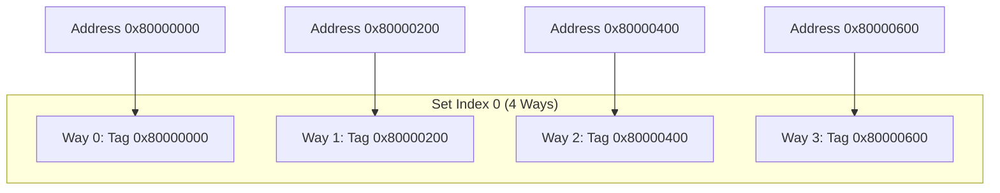

- Stride between lines mapping to Set 0 = $16 \times 32\text{ bytes} = 512\text{ bytes}\ (0\times200)$.
- In `03_conflict_thrashing.S`, the first 4 memory reads access offsets $+0, +512, +1024, +1536$.
- As you step each instruction, watch **Way 0**, then **Way 1**, **Way 2**, and **Way 3** in Set 0 transition from `[V:0]` to `[V:1]`.

---

## Part 3: Conflict Thrashing, LRU Eviction & Performance (15 min)

### Exercise 4: 5-Way Conflict Thrashing & LRU Eviction (10 min)

What happens when a program accesses **5** different addresses that all map to the **same 4-way set**?

**Workload Source:** `/mnt/archlab/study/cache/03_conflict_thrashing.S`

```assembly
thrash_loop:
    beqz a1, done
    lw t0, 0x000(a0)        # Access 1 -> Set 0 (Way 0)
    lw t1, 0x200(a0)        # Access 2 -> Set 0 (Way 1)
    lw t2, 0x400(a0)        # Access 3 -> Set 0 (Way 2)
    lw t3, 0x600(a0)        # Access 4 -> Set 0 (Way 3) - Set 0 is now FULL!
    addi t5, a0, 0x400
    lw t4, 0x400(t5)        # Access 5 (0x800) -> Set 0 -> Conflict Miss! Evicts LRU Way 0!
    addi a1, a1, -1
    j thrash_loop
```

#### Step-by-Step Instructions:
1. Launch the exercise:
   ```bash
   simrv -m /mnt/archlab/study/cache/03_conflict_thrashing.bin -b -C
   ```
2. Navigate to the Cache Inspector (`r`).
3. Step through the first 4 `lw` instructions.
   - **Status:** All 4 ways in Set 0 are filled.
4. Step through the 5th `lw` instruction (`lw t4, 0x400(t5)` accessing `a0 + 0x800`).
   - **Observation:** Notice the status changes to:
     `◄ MISS ▸ REPLACED`
   - SimRV's LRU replacement policy selects **Way 0** (the oldest accessed) and overwrites its tag with `0x80000800`.
5. Now step into the second iteration of `thrash_loop`:
   - Instruction 1 asks for `0x000(a0)` again, but it was just evicted!
   - **Result:** `MISS ▸ REPLACED` again, evicting Way 1!
   - **Conclusion:** Because the working set ($5\text{ lines}$) exceeds associativity ($4\text{ ways}$), every single load in the loop misses—a catastrophic phenomenon known as **Cache Thrashing**.

#### Performance Comparison:

Run all three exercises in CLI mode and compare the stall metrics:

```bash
simrv -m /mnt/archlab/study/cache/01_spatial_locality.bin -b -c -C -s 50
simrv -m /mnt/archlab/study/cache/02_temporal_locality.bin -b -c -C -s 100
simrv -m /mnt/archlab/study/cache/03_conflict_thrashing.bin -b -c -C -s 100
```

| Metric | Exercise 1 (Spatial) | Exercise 2 (Temporal) | Exercise 3 (Thrashing) |
| :--- | :--- | :--- | :--- |
| **DCache Miss Stalls** | 30 cycles (2 cold misses) | 15 cycles (1 cold miss) | **210 cycles** (continuous misses) |
| **CPI (Cycles Per Instr)** | ~2.04 | ~1.59 | **~3.26** |
| **Stall Percentage** | 50.0% | 36.5% | **69.0%** |

---

## Part 4: Advanced Topic - Multicore Cache Coherence

In shared-memory symmetric multiprocessing (SMP) systems, each core possesses private L1 caches (and sometimes private L2 caches) while sharing main memory (DRAM).

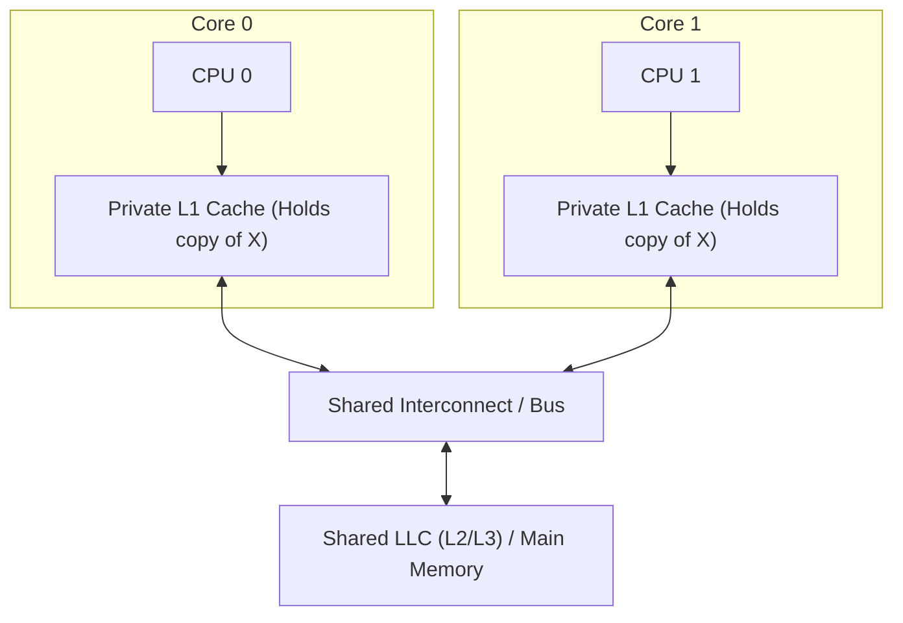

### 4.1 The Cache Coherence Problem

Suppose address $X$ holds initial value `0`:
1. **Core 0** reads $X$: fetches `0` into its private L1.
2. **Core 1** reads $X$: fetches `0` into its private L1.
3. **Core 0** writes `X = 42` into its private L1 (using write-back policy).
4. **Core 1** reads $X$ again: without a coherence mechanism, Core 1 reads the **stale** value `0` from its private cache, violating data consistency!

---

### 4.2 Cache Coherence vs. Memory Consistency

Architecture students must clearly distinguish between these two foundational concepts:

| Dimension | Cache Coherence | Memory Consistency Models |
| :--- | :--- | :--- |
| **Scope** | Accesses to a **single** memory address ($X$). | Ordering of accesses across **multiple** distinct addresses ($X, Y, \dots$). |
| **Invariant** | **SWMR (Single-Writer, Multiple-Reader):** At any given time, an address is either read-only by multiple cores, or read-write by at most one core. | Defines legal observable orderings of memory operations (e.g. TSO, Sequential Consistency, RISC-V RVWMO). |
| **Implementation** | Hardware protocols (Snooping / Directory). | Pipeline ordering rules, Store Buffers, Memory Barriers (`FENCE`). |

---

### 4.3 Hardware Coherence Mechanisms: Snooping vs. Directory

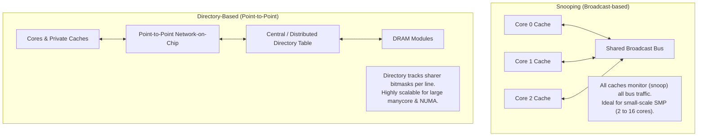

---

### 4.4 The Classic MESI (Illinois) Protocol

The **MESI protocol** is an invalidation-based coherence protocol utilizing 4 line states:

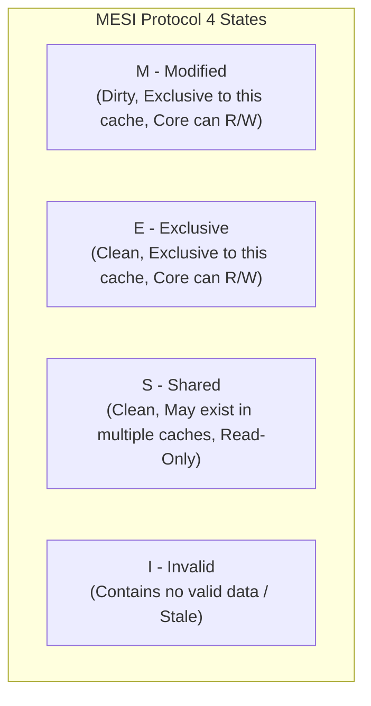

#### State Definitions:
- **`M` (Modified):** The line is present **only** in this cache and is **dirty** (main memory is out of date). The local core has exclusive read and write permissions.
- **`E` (Exclusive):** The line is present **only** in this cache and is **clean** (matches main memory). The local core can silently upgrade to `M` on a write without issuing a bus invalidation.
- **`S` (Shared):** The line is clean and present in **one or more** caches. The local core may read, but must issue a `BusUpgr` (Bus Upgrade) or `BusRdX` to write.
- **`I` (Invalid):** The line does not contain valid data (either unallocated or invalidated by a remote write).

#### Core MESI State Transitions:

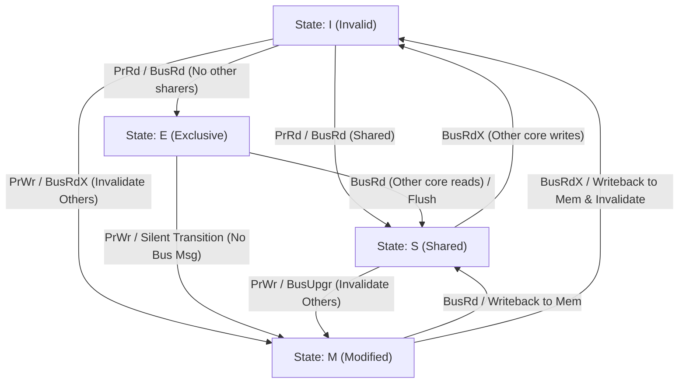

#### Bus Events Reference:
- `PrRd` / `PrWr`: Local Processor Read / Processor Write.
- `BusRd`: Bus Read request generated when a core misses on a read.
- `BusRdX` (Read-with-Intent-to-Modify): Bus Read request with invalidation, issued on a write miss.
- `BusUpgr`: Invalidation broadcast generated when a core writes to a line in state `S`.

---

### 4.5 Advanced Protocol Extensions: MOESI & MESIF

1. **MOESI Protocol (AMD / ARM):**
   - Adds the **`O` (Owner)** state.
   - An Owner cache holds a *dirty* line that is also shared by other caches in state `S`.
   - **Advantage:** When a remote core reads a dirty line, the Owner cache supplies the data directly over the interconnect without writing back to DRAM, saving DRAM writeback bandwidth.

2. **MESIF Protocol (Intel Nehalem & later):**
   - Adds the **`F` (Forwarder)** state.
   - When a block is shared across multiple caches in state `S`, exactly one cache is designated as the **Forwarder (`F`)** responsible for answering broadcast read requests.
   - **Advantage:** Eliminates redundant multiple replies on point-to-point interconnects.

---

### 4.6 The False Sharing Pitfall in Multicore Software

**False Sharing** occurs when two distinct threads executing on different cores update independent variables that happen to reside within the **exact same cache line**.

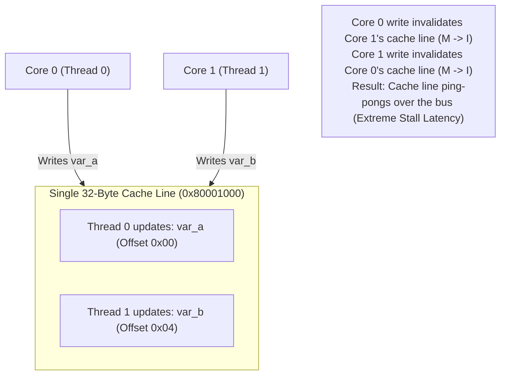

#### Software Solution: Cache Line Alignment & Padding
In C++ and RISC-V assembly, align independent per-thread data structures to cache line boundaries:

```cpp
// Bad: var_a and var_b share the same cache line (False Sharing)
struct SharedDataBad {
    uint64_t counter_thread0;
    uint64_t counter_thread1;
};

// Good: Aligned to SimRV 32-byte cache line (No False Sharing)
struct SharedDataGood {
    alignas(32) uint64_t counter_thread0;
    alignas(32) uint64_t counter_thread1;
};
```

---

## Check-Your-Understanding Quiz (5 min)

### Q1: Address Bitfield Calculation
> **Question:** An RV32 system has a $4\text{ KiB}$ cache with $64\text{-byte}$ cache lines and $2\text{-way}$ set associativity. Calculate the number of offset bits, index bits, and tag bits.
>
> <details>
> <summary><b>Click to reveal Answer & Explanation</b></summary>
>
> 1. **Offset Bits:** $b = \log_2(64) = 6\text{ bits}\quad (\text{Bits } [5:0])$
> 2. **Total Lines:** $\text{Lines} = 4096 / 64 = 64\text{ lines}$
> 3. **Number of Sets:** $S = 64 / 2 = 32\text{ sets}$
> 4. **Index Bits:** $s = \log_2(32) = 5\text{ bits}\quad (\text{Bits } [10:6])$
> 5. **Tag Bits:** $t = 32 - (6 + 5) = 21\text{ bits}\quad (\text{Bits } [31:11])$
> </details>

---

### Q2: 3 Cs of Cache Misses
> **Question:** Identify which type of cache miss (Compulsory, Capacity, or Conflict) occurs in each scenario:
> 1. The very first time a program accesses a variable after boot.
> 2. A program loops over an array of size $8\text{ KiB}$ on a $2\text{ KiB}$ cache.
> 3. A program accesses 5 addresses separated by $512\text{ bytes}$ on SimRV's 4-way $2\text{ KiB}$ cache.
>
> <details>
> <summary><b>Click to reveal Answer & Explanation</b></summary>
>
> 1. **Compulsory (Cold) Miss:** The data has never been loaded into the cache before.
> 2. **Capacity Miss:** The total working set size ($8\text{ KiB}$) exceeds total cache capacity ($2\text{ KiB}$), even with full associativity.
> 3. **Conflict Miss:** The total active lines ($5\text{ lines} = 160\text{ B}$) easily fit in the $2\text{ KiB}$ cache, but all 5 map to the same set which only holds 4 ways.
> </details>

---

### Q3: MESI Protocol State Transitions
> **Question:** In a dual-core system implementing the MESI protocol:
> 1. Core 0 reads address $X$ (which is absent in both caches). What state does Core 0's cache line enter?
> 2. Next, Core 1 reads address $X$. What are the resulting states in Core 0 and Core 1?
> 3. Next, Core 0 writes to address $X$. What transitions occur in Core 0 and Core 1, and what bus transaction is issued?
>
> <details>
> <summary><b>Click to reveal Answer & Explanation</b></summary>
>
> 1. **Core 0 enters `E` (Exclusive):** Since no other cache holds $X$, Core 0 has exclusive, clean ownership.
> 2. **Both Core 0 and Core 1 transition to `S` (Shared):** Core 1 issues `BusRd`. Core 0 detects the read, supplies or permits the transfer, and both caches now hold clean, read-only copies.
> 3. **Core 0 transitions `S` $\rightarrow$ `M` (Modified), Core 1 transitions `S` $\rightarrow$ `I` (Invalid):** Core 0 issues a `BusUpgr` (or `BusRdX`) on the bus, invalidating Core 1's copy so Core 0 can safely modify the line locally.
> </details>

---

### Q4: False Sharing Diagnosis
> **Question:** In a multi-threaded parallel sum program running on 4 CPU cores, adding more threads causes execution time to *increase* by 10x despite zero lock contention. What hardware cache phenomenon is occurring, and how can the software fix it?
>
> <details>
> <summary><b>Click to reveal Answer & Explanation</b></summary>
>
> - **Cause:** **False Sharing**. Each thread is frequently writing to its own partial sum element in an array (`sum[thread_id]`). Because adjacent array elements reside inside the same 32-byte (or 64-byte) cache line, each thread's write invalidates the cache line in all other cores (ping-ponging state `M` $\leftrightarrow$ `I`).
> - **Fix:** Pad each partial sum variable or align each entry with `alignas(64)` so each thread's accumulator occupies an independent cache line.
> </details>

---

## Instructor Notes & Research Discussion Prompts

- **Visualizing LRU Updates:** Point out to students that in SimRV's TUI, accessing an already valid way updates its `LRU` tick number to the current CPU tick, keeping it "fresh" and protecting it from being chosen as the next eviction victim.
- **Write Policies in SimRV:** Explain that SimRV currently models a write-through / write-allocate behavior for store instructions (`sw`, `sh`, `sb`), keeping cache and backing memory coherent.
- **Multicore Research Directions:** For graduate student projects, SimRV's multicore foundation (`SIMRV_CORE_COUNT`) can be extended with a cycle-accurate Snooping bus model or Directory controller tracking `MESI` states across private L1 instances.
- **Source Inspection:** Encourage students to inspect `src/cache/BaseCache.hpp` and `src/cache/DCache.cpp` to see how bit masks and array lookups map directly to hardware logic gates.
