# 勉強会：SimRVで学ぶキャッシュ技術とアーキテクチャ

**対象者:** コンピュータアーキテクチャを学ぶ学部生・大学院生・システムエンジニア  
**所要時間:** 60分（ハンズオン実習）＋ マルチコアキャッシュコヒーレンス発展講義  
**ターゲットISA:** RISC-V 32-bit (`RV32GC`)  
**シミュレータモジュール:** `module load archlab/simrv` (`simrv` / `SimRV`)  

---

## 環境設定とモジュールのロード

実習を始める前に、シェルの環境モジュールから SimRV をロードします：

```bash
# SimRV シミュレータモジュールのロード
module load archlab/simrv

# インストールの確認
simrv --version
```

実習用の事前ビルド済みバイナリおよびアセンブリソースは `/mnt/archlab/study/cache/` に配置されています。

---

## セッション概要とタイムテーブル

近年のCPUは主記憶（DRAM）よりも圧倒的に高速に命令を実行できます。この速度差に起因するボトルネックは「**メモリの壁（Memory Wall）**」と呼ばれます。キャッシュメモリは、プログラムが持つ**時間的局所性（Temporal Locality）**と**空間的局所性（Spatial Locality）**を活用することで、このレイテンシの差を埋める重要な役割を果たします。さらに、マルチコア環境ではプライベートキャッシュ間でデータの不整合を防ぐ**キャッシュコヒーレンス（Cache Coherence）**プロトコル（MESI等）が不可欠となります。

本勉強会では、SimRVのサイクル精度シミュレーションおよび対話型ターミナルUI（TUI）を活用し、キャッシュ構造、アドレスデコード、局所性の振る舞い、LRU追い出しアルゴリズムを視覚的に体験するとともに、マルチコアに向けたキャッシュコヒーレンス理論を体系的に学びます。

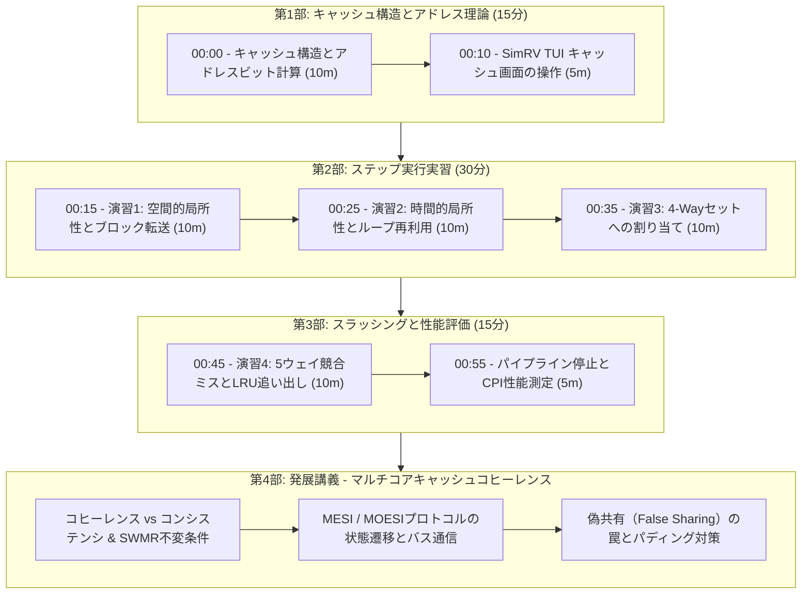

| パート | 時間配分 | 内容 / アクティビティ | 主な学習目標 |
| :--- | :--- | :--- | :--- |
| **第1部** | 00:00 – 00:15 | キャッシュ構造とアドレス分解理論 | RV32におけるタグ・セットインデックス・オフセット計算 |
| **第2部** | 00:15 – 00:45 | ステップ実行による局所性実験 | 強制ミス（Cold Miss）と空間・時間ヒストの観察 |
| **第3部** | 00:45 – 01:00 | 5ウェイ競合スラッシングとLRU追い出し | セット容量超過時のLRU Victim選択と性能低下の検証 |
| **第4部** | 発展講義 | マルチコアキャッシュコヒーレンス基礎 | スヌーピング、MESIプロトコル、偽共有の防止 |

---

## 第1部: キャッシュアーキテクチャの基礎 (15分)

### 1.1 SimRV L1キャッシュの諸元（Geometry）

SimRVは独立したL1命令キャッシュ（`ICache`）およびL1データキャッシュ（`DCache`）を実装しており、以下のパラメータで構成されています：

- **キャッシュ容量:** $2048\text{ バイト}\ (2\text{ KiB})$
- **セット連想度（Associativity）:** $4\text{-way セットアソシアティブ}\ (W = 4)$
- **ブロック（ライン）サイズ:** $32\text{ バイト}\ (B = 32)$
- **総ライン数:** $64\text{ 本}$
- **セット数 ($S$):**
  $$\text{セット数} = \frac{\text{総ライン数}}{\text{連想度}} = \frac{64}{4} = 16\text{ セット}\ (S = 16)$$
- **リプレースメント（追い出し）ポリシー:** 厳密な64ビットアクセスタイムスタンプによる LRU (Least Recently Used)

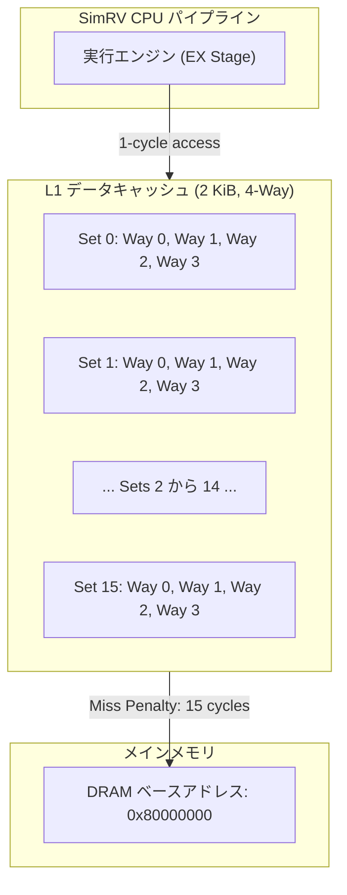

---

### 1.2 RV32のアドレス分解（Tag / Index / Offset）

32ビット物理アドレス空間において、メモリアドレスは以下の3つのフィールドに分割されます：

1. **バイトオフセット ($b$ bit):** 32バイトのキャッシュライン内の特定バイトを選択。
   $$b = \log_2(\text{LineBytes}) = \log_2(32) = 5\text{ bit}\quad (\text{ビット } [4:0])$$
2. **セットインデックス ($s$ bit):** 16個のセットのいずれかを選択。
   $$s = \log_2(\text{NumSets}) = \log_2(16) = 4\text{ bit}\quad (\text{ビット } [8:5])$$
3. **タグ ($t$ bit):** 要求されたアドレスとライン内のデータが一致しているかを検証する識別子。
   $$t = 32 - (s + b) = 32 - (4 + 5) = 23\text{ bit}\quad (\text{ビット } [31:9])$$

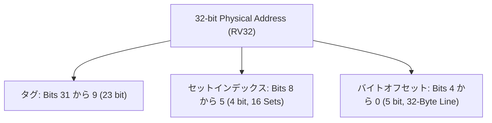

#### アドレス分解の計算例

| 物理アドレス | 2進数表記 (Bits 31..0) | タグ (Hex) | セット (Dec) | オフセット (Hex) |
| :--- | :--- | :--- | :--- | :--- |
| `0x80001000` | `1000 0000 0000 0000 0001 0000 0000 0000` | `0x400008` | Set `0` (`0000`) | `0x00` (`00000`) |
| `0x80001004` | `1000 0000 0000 0000 0001 0000 0000 0100` | `0x400008` | Set `0` (`0000`) | `0x04` (`00100`) |
| `0x80001020` | `1000 0000 0000 0000 0001 0000 0010 0000` | `0x400008` | Set `1` (`0001`) | `0x00` (`00000`) |
| `0x80001200` | `1000 0000 0000 0000 0001 0010 0000 0000` | `0x400009` | Set `0` (`0000`) | `0x00` (`00000`) |

> [!TIP]
> **セットストライドルール:** $16 \times 32\text{ バイト} = 512\text{ バイト}\ (0\times200)$ 刻みのアドレスは、インデックスビット（`[8:5]`）がすべて同一（`0000`）となり、**完全に同じキャッシュセット**へとマッピングされます。

---

### 1.3 SimRVにおけるキャッシュラインの内部構造

SimRVの `BaseCache.hpp` で管理される各キャッシュラインのエントリ構造：

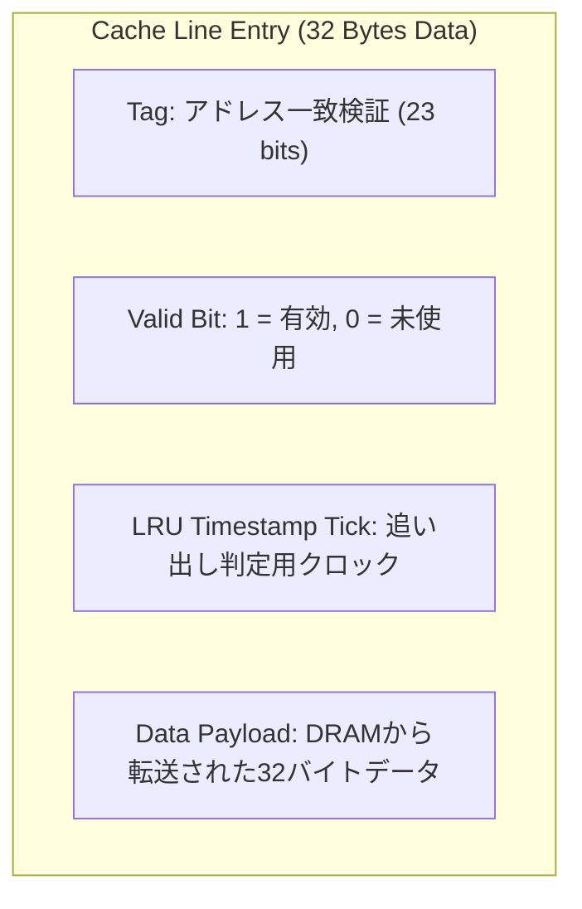

- `valid`: 有効ビット。初期状態は $0$、メモリからデータが格納されると $1$。
- `tag`: アドレス一致判定用のタグ値。
- `last_used`: LRU追い出し判定用のアクセスクロック（タイムスタンプ）。
- `data`: DRAMから一度に転送される32バイトのデータペイロード。

---

### 1.4 SimRV TUI キャッシュインスペクタの操作方法

キャッシュシミュレーションを有効化するには `-C`（`--cycle-accurate`）オプションを指定して起動します：

```bash
simrv -m /mnt/archlab/study/cache/01_spatial_locality.bin -b -C
```

#### 主なキー操作:
- `r`: 左ペインの表示を切り替え（**Cache** 表示になるまで押す）。
- `s` または `Space`: 1命令ずつステップ実行。
- `c`: 連続実行（一時停止は `p`）。
- `g`: ガイド表示（Guided Inspection）のON/OFF。
- `q`: シミュレータの終了。

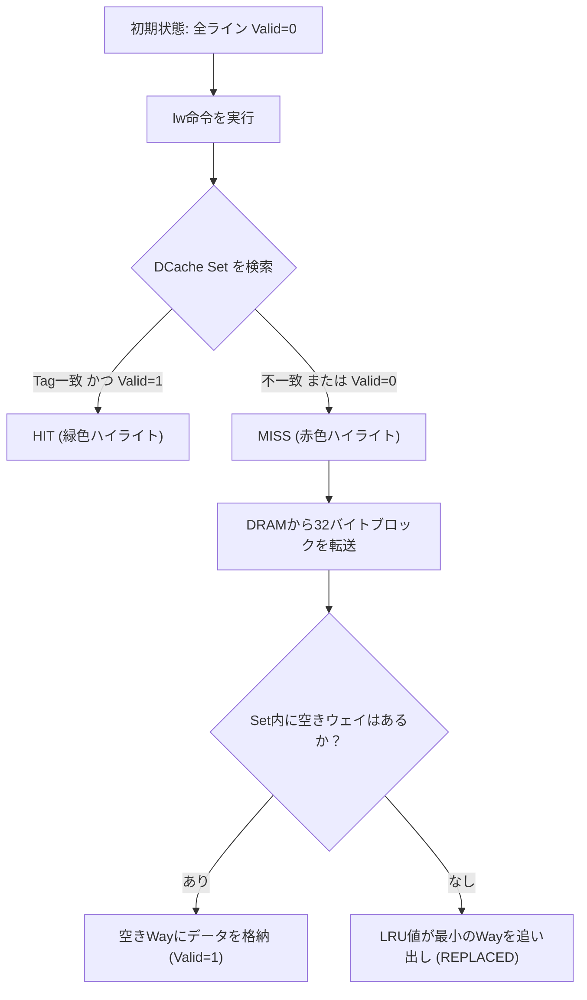

---

## 第2部: ステップ実行による局所性実験 (30分)

### 演習1: 強制ミスと空間的局所性 (10分)

**使用ファイル:** `/mnt/archlab/study/cache/01_spatial_locality.S`

```assembly
.section .text
.global _start
_start:
    la a0, test_data_buffer
    lw t0,  0(a0)    # オフセット +0  -> MISS (Cold / 強制ミス)
    lw t1,  4(a0)    # オフセット +4  -> HIT  (空間的局所性)
    lw t2,  8(a0)    # オフセット +8  -> HIT  (空間的局所性)
    lw t3, 12(a0)    # オフセット +12 -> HIT  (空間的局所性)
    lw t4, 16(a0)    # オフセット +16 -> HIT  (空間的局所性)
    lw t5, 20(a0)    # オフセット +20 -> HIT  (空間的局所性)
    lw t6, 24(a0)    # オフセット +24 -> HIT  (空間的局所性)
    lw s1, 28(a0)    # オフセット +28 -> HIT  (空間的局所性)

    # 次のキャッシュライン (オフセット +32):
    lw s2, 32(a0)    # オフセット +32 -> MISS (32バイト境界を跨ぐ)
    lw s3, 36(a0)    # オフセット +36 -> HIT  (空間的局所性)
done:
    j done
```

#### 実習手順:
1. プログラムを起動します：
   ```bash
   simrv -m /mnt/archlab/study/cache/01_spatial_locality.bin -b -C
   ```
2. `r` キーを押して左ペインを **Cache** 表示に切り替えます。
3. `s` を押して `la a0, test_data_buffer` を実行します。
4. 次に `lw t0, 0(a0)` を実行します。
   - **確認ポイント:** DCache Set 0 に `MISS` が表示され、Way 0 が有効（`[V:1]`）になり、DRAMから32バイトが一括ロードされます。
5. `s` を7回連続で押し、`lw t1` から `lw s1` までを実行します。
   - **確認ポイント:** すべての命令で緑色の `◄ HIT` が表示されます。初回アクセスで32バイト分まとめてキャッシュに読み込まれたため、後続の7ワード（+4〜+28バイト）はDRAMアクセスなしで高速ヒットします（**空間的局所性**）。
6. `lw s2, 32(a0)` を実行します。
   - **確認ポイント:** オフセット `+32` はライン境界を跨ぐため（`Set Index = 1`）、新たな `MISS` が発生し、Set 1のWay 0にデータがロードされます。

---

### 演習2: 時間的局所性（データの再利用） (10分)

**使用ファイル:** `/mnt/archlab/study/cache/02_temporal_locality.S`

```assembly
.section .text
.global _start
_start:
    la a0, array_data       # ベースアドレス
    li a1, 5                # ループ回数: 5回
    li a2, 0

outer_loop:
    beqz a1, done
    lw t0, 0(a0)            # 1周目はミス、2〜5周目はヒット！
    add a2, a2, t0
    lw t1, 4(a0)            # 全周回でヒット
    add a2, a2, t1
    addi a1, a1, -1
    j outer_loop
done:
    j done
```

#### 実習手順:
1. プログラムを起動します：
   ```bash
   simrv -m /mnt/archlab/study/cache/02_temporal_locality.bin -b -C
   ```
2. Cache表示画面に切り替えます（`r` キー）。
3. `outer_loop` の1周目をステップ実行します。
   - 最初の `lw t0, 0(a0)` で強制ミスが発生し、キャッシュラインがロードされます。
4. 2周目、3周目、4周目、5周目をステップ実行します。
   - **確認ポイント:** 2周目以降は `lw t0` も含めてすべてのロード命令が `◄ HIT` となります。データがキャッシュから追い出される前に繰り返しアクセスされることで、高いヒット率が維持されます（**時間的局所性**）。
5. 画面下部の `DCache Hit Rate` ゲージが $90\%$ 以上に急上昇することを確認します。

---

### 演習3: 4-Wayセット連想度とウェイの割り当て (10分)

SimRVの4-wayセットアソシアティブ構成では、**同一のセットインデックスにマッピングされるアドレスであっても、最大4ラインまで**同時に保持できます。

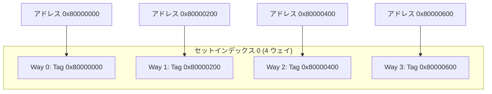

- Set 0にマッピングされるアドレス同士の間隔（ストライド）は $16 \times 32\text{ バイト} = 512\text{ バイト}\ (0\times200)$。
- `03_conflict_thrashing.S` の最初の4命令は、オフセット $+0, +512, +1024, +1536$ にアクセスします。
- 1命令ずつステップ実行すると、Set 0の **Way 0 $\rightarrow$ Way 1 $\rightarrow$ Way 2 $\rightarrow$ Way 3** が順番に `[V:0]` から `[V:1]` へと埋まっていく様子を確認できます。

---

## 第3部: 競合ミス・LRU追い出しと性能評価 (15分)

### 演習4: 5ウェイ競合スラッシングとLRU追い出し (10分)

4ウェイのセットに対して、**5つ**の競合するアドレスへ繰り返しアクセスすると何が起きるでしょうか？

**使用ファイル:** `/mnt/archlab/study/cache/03_conflict_thrashing.S`

```assembly
thrash_loop:
    beqz a1, done
    lw t0, 0x000(a0)        # アクセス1 -> Set 0 (Way 0に格納)
    lw t1, 0x200(a0)        # アクセス2 -> Set 0 (Way 1に格納)
    lw t2, 0x400(a0)        # アクセス3 -> Set 0 (Way 2に格納)
    lw t3, 0x600(a0)        # アクセス4 -> Set 0 (Way 3に格納) -> Set 0が満杯!
    addi t5, a0, 0x400
    lw t4, 0x400(t5)        # アクセス5 (0x800) -> Set 0 -> コンフリクトミス! LRUのWay 0を追い出し!
    addi a1, a1, -1
    j thrash_loop
```

#### 実習手順:
1. プログラムを起動します：
   ```bash
   simrv -m /mnt/archlab/study/cache/03_conflict_thrashing.bin -b -C
   ```
2. `r` キーでCache表示にします。
3. 最初の4つの `lw` を実行し、Set 0の全ウェイ（Way 0〜3）が埋まるのを確認します。
4. 5つ目のロード（`lw t4, 0x400(t5)`、実アドレス `a0 + 0x800`）を実行します。
   - **確認ポイント:** 画面に以下のハイライトが表示されます：
     `◄ MISS ▸ REPLACED`
   - LRUアルゴリズムにより、最も古くにアクセスされた **Way 0** が選択され、タグが `0x80000800` で上書きされます。
5. `thrash_loop` の2周目に進みます：
   - 1命令目で再び `0x000(a0)` を要求しますが、直前に追い出されたため **MISS** となり、今度は Way 1 が追い出されます！
   - **結論:** ワーキングセット数（5ライン）が連想度（4ウェイ）を超えているため、ループ内の**すべてのメモリアクセスがミス**となり、激しい性能劣化を引き起こします（**キャッシュスラッシング**）。

#### CLIモードでの性能比較実験:

CLIモードで実行し、キャッシュストール数とCPIを比較してみましょう：

```bash
simrv -m /mnt/archlab/study/cache/01_spatial_locality.bin -b -c -C -s 50
simrv -m /mnt/archlab/study/cache/02_temporal_locality.bin -b -c -C -s 100
simrv -m /mnt/archlab/study/cache/03_conflict_thrashing.bin -b -c -C -s 100
```

| 評価メトリクス | 演習1 (空間的局所性) | 演習2 (時間的局所性) | 演習3 (スラッシング) |
| :--- | :--- | :--- | :--- |
| **DCache ミスストール** | 30 サイクル (2回の冷ミス) | 15 サイクル (1回の冷ミス) | **210 サイクル** (全アクセスミス) |
| **CPI (Cycles Per Instr)** | 約 2.04 | 約 1.59 | **約 3.26** |
| **パイプライン停止率** | 50.0% | 36.5% | **69.0%** |

---

## 第4部: 発展講義 - マルチコアキャッシュコヒーレンス

共有メモリス対称型マルチプロセッサ（SMP）では、各CPUコアが専用のプライベートL1キャッシュを持ちながら、1つのメインメモリを共有します。

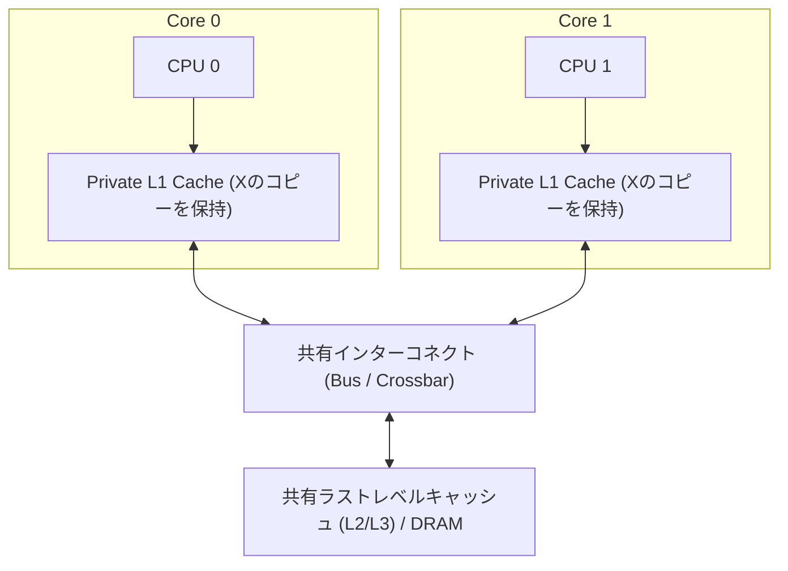

### 4.1 キャッシュコヒーレンス問題（Stale Data問題）

初期値 `0` を持つアドレス $X$ に対して以下の操作が行われた場合を考えます：
1. **Core 0** が $X$ を読み出す：プライベートL1に `0` が格納される。
2. **Core 1** が $X$ を読み出す：プライベートL1に `0` が格納される。
3. **Core 0** が $X$ に `42` を書き込む（Write-Back方式）。
4. **Core 1** が再び $X$ を読み出す：コヒーレンス機構がない場合、Core 1は自身のL1から**古い値（Stale Data）である `0`** を読み出してしまい、データの整合性が崩壊します。

---

### 4.2 コヒーレンス（Coherence）とコンシステンシ（Consistency）の違い

アーキテクチャ研究室において最も重要な概念の区別です：

| 比較項目 | キャッシュコヒーレンス (Coherence) | メモリコンシステンシ (Consistency) |
| :--- | :--- | :--- |
| **対象範囲** | **単一**のメモリアドレス ($X$) に対するアクセス順序。 | **複数**の異なるアドレス ($X, Y, \dots$) に跨がるアクセスの見え方の順序。 |
| **基本不変条件** | **SWMR (Single-Writer, Multiple-Reader):** 任意の時刻において、あるアドレスは「複数コアからReadOnly」または「最大1コアからReadWrite」のいずれかである。 | 各種メモリアクセス命令（Load/Store）が他のコアからどの順序で観測されるべきかを定義（TSO、RVWMO等）。 |
| **実現レイヤ** | ハードウェアコヒーレンスプロトコル（Snooping / Directory）。 | パイプライン制御、ストアバッファ、メモリバリア命令（`FENCE`）。 |

---

### 4.3 コヒーレンス方式：スヌーピング vs ディレクトリ

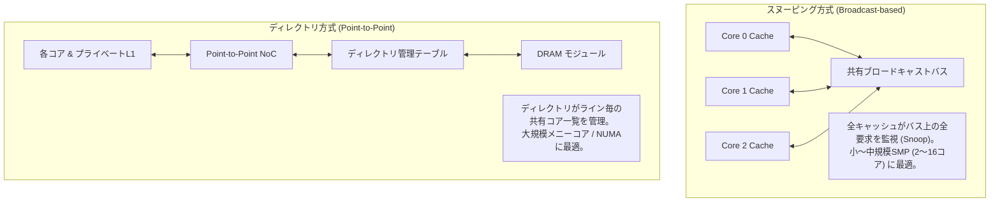

---

### 4.4 代表的な無効化型プロトコル：MESIプロトコル

**MESIプロトコル**（別名: Illinoisプロトコル）は、各キャッシュラインに4つの状態を持たせます：

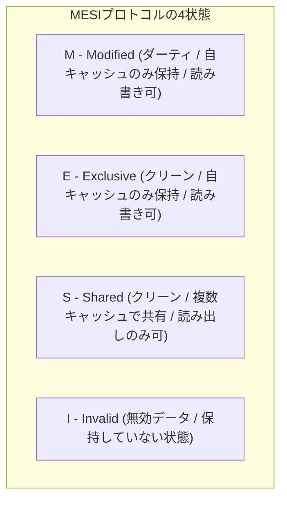

#### 状態の定義:
- **`M` (Modified):** このキャッシュのみが保持し、メインメモリから変更されている（Dirty）。自コアはバス通信なしで即座に読み書き可能。
- **`E` (Exclusive):** このキャッシュのみが保持し、メインメモリと一致している（Clean）。自コアが書き込む際はバス無効化なしでサイレントに `M` へ昇格可能。
- **`S` (Shared):** 複数のキャッシュが同じクリーンなコピーを保持している。読み出しのみ可能。書き込む際は他コアのコピーを無効化する `BusUpgr` または `BusRdX` を発行。
- **`I` (Invalid):** 有効なデータが入っていない（未割り当て、または他コアの書き込みによって無効化された）。

#### MESIの状態遷移図:

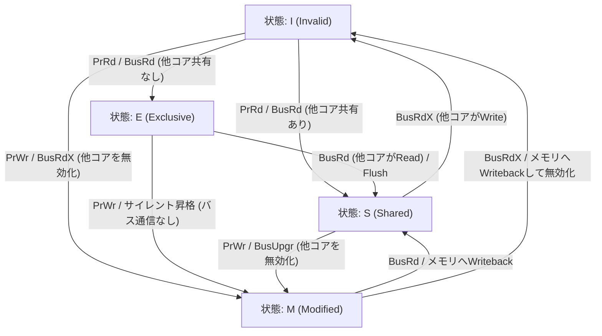

#### 主なバス要求（トランザクション）:
- `PrRd` / `PrWr`: ローカルCPUからの読み出し / 書き込み要求。
- `BusRd`: リードミス時に発行される読み出し要求。
- `BusRdX` (Read-with-Intent-to-Modify): ライトミス時に発行され、データ取得と同時に他キャッシュのコピーを無効化する。
- `BusUpgr`: 状態 `S` から書き込みを行う際、データ再取得を省いて無効化のみを通知する。

---

### 4.5 発展プロトコル：MOESI と MESIF

1. **MOESIプロトコル (AMD / ARM):**
   - **`O` (Owner)** 状態を追加。
   - ダーティなラインを保持したまま複数コアと共有（`S`）できる状態。
   - **利点:** 他コアがReadした際にOwnerキャッシュがインターコネクト上で直接データを供給するため、DRAMへの都度Writebackを回避し、バス帯域を節約します。

2. **MESIFプロトコル (Intel Nehalem以降):**
   - **`F` (Forwarder)** 状態を追加。
   - 複数コアが `S` で共有している際、ただ1つのキャッシュが `F` となり、ブロードキャストされたRead要求への応答を担当。
   - **利点:** Point-to-Pointネットワークにおいて複数コアから重複して応答パケットが返送されるのを防ぎます。

---

### 4.6 ソフトウェアにおける落とし穴：偽共有（False Sharing）

**偽共有（False Sharing）**とは、異なるCPUコア上で動作する別々のスレッドが、**まったく異なる独立した変数**を更新しているにもかかわらず、それらの変数が**偶然同じキャッシュライン（32/64バイト）上に隣接して配置されている**ために発生する性能低下現象です。

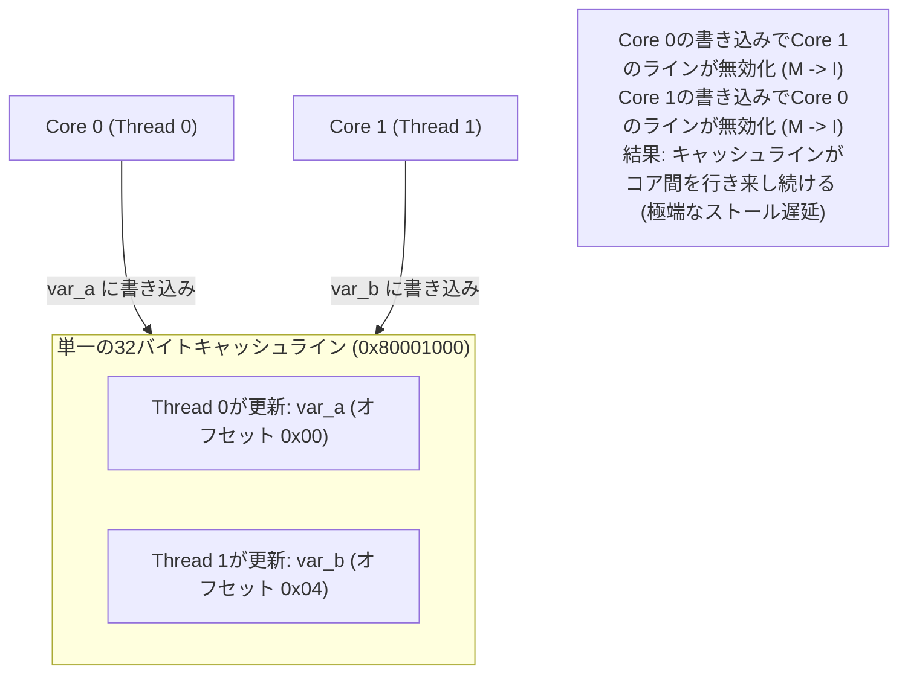

#### 対策：キャッシュライン境界へのアライメントとパディング
C++やアセンブリにおいて、スレッド固有のデータ構造をキャッシュライン境界にアライメントします：

```cpp
// 悪い例: var_a と var_b が同一キャッシュラインに相乗り (偽共有が発生)
struct SharedDataBad {
    uint64_t counter_thread0;
    uint64_t counter_thread1;
};

// 良い例: SimRVの32バイトキャッシュライン境界に明示的に配置 (偽共有を完全防止)
struct SharedDataGood {
    alignas(32) uint64_t counter_thread0;
    alignas(32) uint64_t counter_thread1;
};
```

---

## 理解度チェッククイズ (5分)

### Q1: アドレスビット計算
> **問題:** 32ビットアドレス空間のRV32において、キャッシュ容量 $4\text{ KiB}$、ラインサイズ $64\text{ バイト}$、$2\text{-way}$ セットアソシアティブの場合、オフセット、インデックス、タグの各ビット幅はいくつになるでしょうか？
>
> <details>
> <summary><b>正解と解説を表示</b></summary>
>
> 1. **オフセットビット:** $b = \log_2(64) = 6\text{ bit}\quad (\text{ビット } [5:0])$
> 2. **総ライン数:** $\text{ライン数} = 4096 / 64 = 64\text{ 本}$
> 3. **セット数:** $S = 64 / 2 = 32\text{ セット}$
> 4. **インデックスビット:** $s = \log_2(32) = 5\text{ bit}\quad (\text{ビット } [10:6])$
> 5. **タグビット:** $t = 32 - (6 + 5) = 21\text{ bit}\quad (\text{ビット } [31:11])$
> </details>

---

### Q2: キャッシュミスの3分類（3 Cs）
> **問題:** 次の各事象で発生するキャッシュミスの種類（Compulsory / Capacity / Conflict）を答えてください。
> 1. プログラム起動後、ある変数に初めてアクセスしたとき。
> 2. 容量 $2\text{ KiB}$ のキャッシュに対し、プログラムが $8\text{ KiB}$ の配列を繰り返しループ走査したとき。
> 3. 容量 $2\text{ KiB}$（4-way）のキャッシュに対し、512バイト間隔のアドレス5箇所を交互にアクセスしたとき。
>
> <details>
> <summary><b>正解と解説を表示</b></summary>
>
> 1. **Compulsory（強制 / Cold）ミス:** データが一度もキャッシュに読み込まれたことがないため。
> 2. **Capacity（容量）ミス:** 完全連想であっても、ワーキングセット全体のサイズ（8 KiB）がキャッシュ総容量（2 KiB）を超過しているため。
> 3. **Conflict（競合）ミス:** アクセスしている全データサイズ（160 バイト）はキャッシュ容量（2 KiB）に収まるものの、すべて同じセット（4ウェイ）に衝突して溢れたため。
> </details>

---

### Q3: MESIプロトコルの状態遷移
> **問題:** 2コアSMPシステムにおいてMESIプロトコルを採用しているとします。
> 1. Core 0 がアドレス $X$ を初めて読み出しました（他コアにコピーなし）。Core 0 のライン状態はどうなりますか？
> 2. 続いて Core 1 がアドレス $X$ を読み出しました。Core 0 と Core 1 の状態はそれぞれどうなりますか？
> 3. 続いて Core 0 がアドレス $X$ に書き込みを行いました。Core 0 と Core 1 の状態遷移と、バス上に流れるトランザクションは何ですか？
>
> <details>
> <summary><b>正解と解説を表示</b></summary>
>
> 1. **Core 0 は `E` (Exclusive) に遷移:** 他のどのコアも $X$ を持っていないため、単独のクリーンコピーとして保持します。
> 2. **両コアとも `S` (Shared) に遷移:** Core 1が `BusRd` を発行し、Core 0が応答。両者がクリーンな読み出し専用コピーを共有します。
> 3. **Core 0 は `S` $\rightarrow$ `M` (Modified)、Core 1 は `S` $\rightarrow$ `I` (Invalid) に遷移:** Core 0 がバス上に無効化要求（`BusUpgr` または `BusRdX`）を発行し、Core 1のコピーを無効化することで、安全にローカル書き込みを実行します。
> </details>

---

### Q4: 偽共有（False Sharing）の診断
> **問題:** 4コアCPU上で配列の総和を並列計算するプログラムを実行したところ、ロックの競合がないにもかかわらず、スレッド数を増やすと逆に実行時間が10倍に悪化しました。何が起きていますか？またどう解決しますか？
>
> <details>
> <summary><b>正解と解説を表示</b></summary>
>
> - **原因:** **偽共有（False Sharing）**。各スレッドが頻繁に更新している部分和変数（`sum[thread_id]`）が配列上で隣接しているため、同一のキャッシュラインに収まってしまい、各コアの書き込み毎に他コアのL1ラインが無効化（`M` $\leftrightarrow$ `I` をピンポン）されてバスが飽和したため。
> - **解決策:** 各スレッドの部分和変数を `alignas(64)` などでキャッシュライン境界に配置（パディング）し、互いに異なるキャッシュラインに分離する。
> </details>

---

## 講師向けメモと研究テーマの提案

- **LRU更新の可視化:** SimRVのTUIでは、ヒットしたウェイの `LRU` カウンタが現在のCPUティックに更新されます。これにより「最も最近使われたライン」として保護され、次の追い出し候補から外れる仕組みを学生に説明してください。
- **ライトポリシー:** 現在のSimRVはストア命令（`sw`, `sh`, `sb`）に対してライトスルー（Write-Through / Write-Allocate）モデルを採用しており、キャッシュとメモリの整合性が保たれます。
- **大学院生向け研究テーマ:** SimRVのマルチコア機構（`SIMRV_CORE_COUNT`）を拡張し、プライベートL1間でMESIスヌーピングバスをシミュレーションするサイクル精度のコヒーレンスコントローラの設計・実装課題として活用できます。
- **実装コードへの誘導:** 意欲的な受講者には `src/cache/BaseCache.hpp` および `src/cache/DCache.cpp` を案内し、C++のビット演算がハードウェアの論理ゲート回路とどのように対応しているかを観察させてください。
