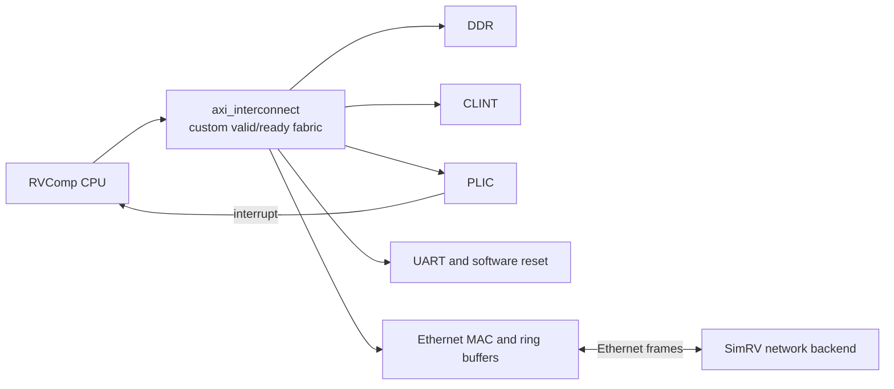

# CPU Model Configuration Guide

SimRV provides a microarchitectural CPU modeling framework that enables cycle-accurate (CA) simulation calibrated to real hardware, FPGA soft cores, and SystemVerilog RTL designs. Microarchitectural definitions are decoupled from the simulator binary and managed via human-readable, sectioned `.cfg` files.

## Platform clock contract

SimRV's virtual platform currently uses a fixed 160 MHz CPU clock and a 10 MHz `mtime` timebase.
Thus, 16 cycle-accurate model cycles equal one `mtime` tick (100 ns). The power-of-two divider keeps
timer accumulation exact and inexpensive. Pipeline, cache,
interconnect, and host-interface latency settings are expressed in CPU clock cycles. Their absolute
time is therefore `cycles / 160 MHz`, while timer delays are `mtime_ticks / 10 MHz`.

This conversion is hardware-meaningful only in `--mode cycle-accurate`, and only to the extent that
the selected model's cycle latencies match the target RTL or processor. Fast and detailed modes use
one virtual cycle per instruction step to keep counters and guest timers deterministic; their
reported virtual time must not be treated as a hardware performance prediction. `minstret` remains
a retired-instruction count in all modes.

---

## 1. Quick Start

For an end-to-end walkthrough of authoring a CPU model file or adding a new emulated MMIO device,
see [Extending CPU Presets and MMIO Platforms](extending-platforms.md).

### Using a Built-In Preset or Model File

SimRV automatically resolves CPU models by preset name or direct file path:

```bash
# Run with canonical pre-installed model preset
simrv --ca --cpu-preset rvcomp -m program.elf

# Run with an explicit custom configuration file
simrv --ca --cpu-preset configs/models/my_core.cfg -m program.elf
# or equivalently:
simrv --ca --cpu-model-file configs/models/my_core.cfg -m program.elf
```

Hardware-backed presets can also describe the complete SoC in the same file. For example,
[`configs/models/rvcomp.cfg`](https://github.com/archlab-sciencetokyo/SimRV/blob/dev/configs/models/rvcomp.cfg)
is an example based on the [ArchLab RVComp repository](https://github.com/archlab-sciencetokyo/RVComp)
and its paper, [“Design and implementation of a high-performance RISC-V SoC for FPGAs with Linux support”](https://www.ieice.org/publications/ken/summary.php?contribution_id=138850&expandable=0&ken_id=R&lang=en&presen_date=2025-09-19&schedule_id=8813&society_cd=ESSNLS&year=2025).
It contains CPU timing, DRAM/boot metadata, a UART map, and an explicit device policy:

```bash
simrv --soc rvcomp --ca -m program.elf
```

Use `--soc` to select a complete platform preset. Combined CPU/SoC model files use `[soc]` for
platform metadata and `[device.<kind>]` for device entries, including `[device.uart]`. A preset
with `device_policy = "explicit"` registers only the devices listed in its file; presets that omit
that policy retain their existing implicit platform devices.

Device-specific SoC entries use `[device.<kind>]` sections. Supported kinds include `uart`,
`rtc`, `dma`, `virtio-block`, `virtio-console`, `virtio-rng`, `virtio-gpu`, `virtio-input`,
`virtio-sound`, and `virtio-net`; each can override `name`, `base`, `size`, and `irq`. The same
normalized map controls runtime MMIO registration and generated Linux device trees. The plain
`[dma]` section remains reserved for CPU timing configuration, so it is not a hardware device
declaration.

To export the resolved registry for tooling or HDL-generation scripts:

```bash
simrv --dump-soc-manifest rvcomp build/rvcomp-soc.json
```

The output follows `schemas/soc-manifest.schema.json` and contains the effective platform, memory,
boot, transport, address, and interrupt metadata after preset-file overrides are applied.

### Example: RVComp RTL address map

This example uses the [RVComp RTL](https://github.com/archlab-sciencetokyo/RVComp), described in the
[RVComp paper](https://www.ieice.org/publications/ken/summary.php?contribution_id=138850&expandable=0&ken_id=R&lang=en&presen_date=2025-09-19&schedule_id=8813&society_cd=ESSNLS&year=2025).
Its preset describes the devices SimRV can register at their RTL addresses: UART at
`0x10000000`, CLINT at `0x02000000`, PLIC at `0x0c000000`, software reset at `0x10000100`, and
the custom Ethernet MAC at `0x14000000`. The UART descriptor uses its 16-byte register window and
PLIC source 1. The Ethernet model uses PLIC source 2 and the RTL-compatible CSR/RX/TX windows; its
packet transport reuses SimRV's user, TAP, or socket network backend. The model reproduces the
guest-visible register and ring-buffer behavior, while external packet transport and PHY
serialization are not cycle-by-cycle RTL emulation. The RTL's broader
address decode also contains these board resources:

!!! info "Decode map and modeled devices are different views"
    The table includes the RTL's decoded address regions, including resources SimRV does not
    allocate or emulate. In particular, the SD-backed RAM row is reference information only; it
    does not add memory to the RVComp preset.

| RTL region | Address range | Size / detail | SimRV model status |
| :--- | :--- | :--- | :--- |
| Boot ROM | `0x00010000–0x00011fff` | 8 KiB | Not registered; RVComp preset starts directly at DRAM. |
| CLINT | `0x02000000–0x020bffff` | 768 KiB decode window | Modeled at the RTL base. |
| PLIC | `0x0c000000–0x0cffffff` | 16 MiB decode window | Modeled at the RTL base. |
| UART | `0x10000000–0x1000000f` | 16-byte register window; PLIC source 1 | Modeled at the RTL base. |
| Software reset | `0x10000100–0x10000103` | One control word | Any write requests a managed SimRV reboot; reads return zero. |
| Ethernet CSRs | `0x14000000–0x14003fff` | 16 KiB | RVComp-specific MAC register model. |
| Ethernet RX buffer | `0x18000000–0x18003fff` | 16 KiB | RX ring window for the RVComp MAC. |
| Ethernet TX buffer | `0x1c000000–0x1c001fff` | 8 KiB | TX ring window for the RVComp MAC. |
| DDR | `0x80000000–0x87ffffff` | 128 MiB on the selected Nexys build | SimRV's backing DRAM is configured separately. |
| SD-backed RAM | `0xa0000000–0xbfffffff` | RTL decode window; RTL macro declares a 1.5 GiB controller capacity | RTL-only; not an additional SimRV RAM region. |

The RVComp RTL calls its memory-mapped channel fabric AXI and routes the CPU through
`axi_interconnect`. This is a custom valid/ready interface rather than full AXI4: stores present
address, data, and byte strobes together, reads use address and response handshakes, and the fabric
has independent read and write state machines that each handle one request at a time. The CPU data
path is 32 bits, while the instruction/cache/DDR path is 128 bits. Address decode and target
responses are implemented per device in the RTL.

SimRV's CA execution routes accesses through its TileLink-style timing fabric and applies the
RVComp model's calibrated request/response delays. It does not reproduce the RTL's valid/ready
handshakes, per-target backpressure, or independent read/write state machines cycle by cycle.
SimRV's `Axi4Bridge` is a separate adapter API; enabling it does not reproduce this custom fabric.
The RVComp MAC does not use VirtIO registers: its model adapts RVComp's ring-buffer interface to the
shared network packet backend. The RVComp model therefore leaves `[axi].enabled` false. A
cycle-by-cycle fabric model must preserve the existing RTL parity gates while modeling the custom
handshakes and address decode above.



The diagram shows device relationships, not address proportions; use the table above for the
exact RTL ranges.

### Generating a New Model Configuration

#### Option A: Interactive CLI Wizard

SimRV includes an interactive questionnaire tool that guides you through tailoring latencies, predictors, and caches:

```bash
# Interactive wizard
python3 scripts/cpu_model_wizard.py --name custom_riscv

# Scaffold non-interactively from an existing template
python3 scripts/cpu_model_wizard.py --template rvcomp --name rvcomp_tuned --output configs/models/rvcomp_tuned.cfg --non-interactive
```

#### Option B: Simulator Scaffolding Flags

Generate an annotated `.cfg` configuration directly from the `simrv` executable:

```bash
# Dump an existing preset to stdout or a file
simrv --dump-cpu-model rvcomp configs/models/rvcomp_copy.cfg

# Scaffold a default balanced template
simrv --scaffold-cpu-model configs/models/new_core.cfg
```

#### Option C: In the Interactive TUI

1. Launch SimRV in cycle-accurate mode (`simrv --ca -m program.elf`).
2. Press `F12` or open Settings (`[3]` Microarchitecture tab).
3. Adjust pipeline latencies, predictor capacities, or forwarding rules with arrows or number keys.
4. Press `[S]` or select **Save configuration** to open the **Save CPU Model Configuration** modal.
5. Enter your preferred filename/path (e.g. `configs/models/my_experiment.cfg`) and press `Enter`.

---

## 2. Configuration Folder Convention & Lookup Hierarchy

SimRV looks for CPU model configuration files in the canonical `configs/models/` directory. When `--cpu-preset <TARGET>` is supplied:

1. **Direct Path**: If `<TARGET>` is a valid file path, it is loaded immediately.
2. **Path with Extension**: If `<TARGET>.cfg` exists, it is loaded.
3. **Canonical Project Folder**: SimRV checks `./configs/models/<TARGET>.cfg`.
4. **Environment Variable**: SimRV checks `$SIMRV_CONFIG_DIR/models/<TARGET>.cfg` or `$SIMRV_CONFIG_DIR/<TARGET>.cfg`.
5. **Built-In Fallback**: If no file is found, SimRV falls back to minimal compiled generic defaults (`tiny`, `balanced`, `performance`).

---

## 3. Configuration Format Reference (`.cfg`)

SimRV CPU model configurations follow a clean INI/TOML sectioned format with support for comments (`#` and `;`), unquoted numbers/booleans, and quoted strings.

### Sample Configuration: RVComp example (`configs/models/rvcomp.cfg`)

```ini
# SimRV CPU Model Configuration: Archlab RVComp
[cpu]
name = "rvcomp"
description = "Archlab RVComp 5-stage educational RISC-V processor"
xlen = 32
isa_preset = "ima"

[pipeline]
type = "five-stage"
enable_forwarding = true
mul_latency = 2
div_latency = 34
fp_alu_latency = 3
fp_div_latency = 15
branch_mispredict_penalty = 4
cycle_counter_start_delay = 0
csr_flush_penalty = 3
fence_flush_penalty = 4

[branch_predictor]
type = "bimodal"
btb_entries = 512
bht_entries = 8192
ras_entries = 16
ghr_bits = 10
pc_shift = 2
enable_btb = true
enable_ras = false
untagged_btb = true
predict_non_control = true
registered_btb_read = false
bht_initial_state = 1

[instruction_cache]
capacity_bytes = 16384
associativity = 1
line_bytes = 32
hit_latency = 1
miss_latency = 1

[data_cache]
capacity_bytes = 16384
associativity = 1
line_bytes = 32
hit_latency = 4
miss_latency = 1

[interconnect]
request_latency = 1
response_latency = 1
```

---

## 4. Parameter Dictionary

### `[cpu]` Section

| Parameter | Type | Default | Description |
| :--- | :--- | :--- | :--- |
| `preset` | string | `"balanced"` | Built-in CPU model preset: `tiny`, `balanced`, or `performance`. Use a model `name` for custom configurations. |
| `name` | string | `"custom"` | Identifier for the CPU model or custom configuration. |
| `description` | string | `""` | Human-readable documentation of the core architecture. |
| `xlen` | integer | `0` | Supported machine XLEN: `32` (RV32-only), `64` (RV64-only), or `0` (supports both RV32 and RV64 targets). Verified on startup against simulator build. |
| `isa_preset` | string | `"gcbv"` | Target ISA extension preset: `gcbv`, `imac`, `ima`, `gc`, `im`, `i`. Setting extension names without `rv32`/`rv64` prefix allows the model to support both 32-bit and 64-bit simulator targets. Explicit `rv32*` and `rv64*` targets are also accepted. |

### `[pipeline]` Section

| Parameter | Type | Default | Description |
| :--- | :--- | :--- | :--- |
| `type` | string | `"five-stage"` | Pipeline structure: `"five-stage"` or `"three-stage"`. |
| `enable_forwarding` | bool | `true` | Enables EX-to-EX and MEM-to-EX operand bypass forwarding. |
| `mul_latency` | uint | `2` | Additional execution stall cycles after issue for integer multiplication (`MUL`, `MULH`, etc.). Zero adds no stall cycles. |
| `div_latency` | uint | `17` | Additional execution stall cycles after issue for integer division and remainder (`DIV`, `REM`). Zero adds no stall cycles. |
| `fp_alu_latency` | uint | `3` | Additional execution stall cycles after issue for single/double-precision floating-point additions and multiplications. |
| `fp_div_latency` | uint | `15` | Additional execution stall cycles after issue for floating-point division and square root operations. |
| `branch_mispredict_penalty` | uint | `3` | Recovery flush penalty in cycles when a branch is mispredicted. |
| `cycle_counter_start_delay` | uint | `0` | Delay in clock cycles before the `mcycle` counter starts incrementing after reset deassertion. |
| `host_interface_latency` | uint | `0` | Completion latency for cycle-mode writes to the HTIF/tohost interface. Zero publishes the write immediately. |
| `host_interface_phase_period` | uint | `0` | Optional transport phase period. A write issued at phase `p` adds `p` cycles, modeling a phase-aligned host interface. |
| `csr_flush_penalty` | uint | `3` | Pipeline stall/drain penalty when executing serializing CSR instructions. |
| `fence_flush_penalty` | uint | `4` | Pipeline stall/drain penalty when executing `FENCE` or `FENCE.I`. |

### `[branch_predictor]` Section

| Parameter | Type | Default | Description |
| :--- | :--- | :--- | :--- |
| `type` | string | `"bimodal"` | Prediction algorithm: `"none"`, `"static"`, `"bimodal"`, `"gshare"`, `"tournament"`. |
| `btb_entries` | uint | `256` | Number of Branch Target Buffer (BTB) cache entries (power of 2). |
| `bht_entries` | uint | `1024` | Number of 2-bit saturating counters in the Branch History Table (PHT/BHT). |
| `ras_entries` | uint | `16` | Return Address Stack depth for function call/return acceleration. |
| `ghr_bits` | uint | `10` | Global History Register bitwidth used in `gshare` hashing. |
| `pc_shift` | uint | `1` | Shift applied to branch PC before indexing tables (1 for RVC 16-bit instructions, 2 for 32-bit aligned instructions). |
| `enable_btb` | bool | `true` | Enables branch target caching. |
| `enable_ras` | bool | `true` | Enables Return Address Stack. |
| `untagged_btb` | bool | `false` | When true, BTB entries omit tag checks, indexing solely via lower PC bits. |
| `predict_non_control` | bool | `false` | When true, an untagged BTB may redirect a non-control instruction on an aliased taken entry, matching predictors that access every fetch PC. |
| `jump_uses_direction_counter` | bool | `false` | Require the BTB direction counter to predict a direct jump taken. Use this for unified BTB/PHT designs that do not special-case `JAL`. |
| `jump_uses_current_btb` | bool | `false` | Use the current-PC BTB entry for direct jumps even when conditional predictions consume a registered BTB output. |
| `registered_btb_read` | bool | `false` | Set to true if BTB output takes 1 cycle to latch, inserting a 1-cycle bubble on predicted taken branches. |
| `bht_initial_state` | uint | `0` | Initial 2-bit counter value: `0` (Strongly Not Taken), `1` (Weakly Not Taken), `2` (Weakly Taken), `3` (Strongly Taken). |

### `[instruction_cache]` and `[data_cache]` Sections

| Parameter | Type | Default | Description |
| :--- | :--- | :--- | :--- |
| `capacity_bytes` | uint | `4096` | Total cache capacity in bytes (e.g. `16384` for 16 KiB). |
| `associativity` | uint | `1` | Cache set associativity (`1` for direct-mapped, `2`, `4`, etc.). |
| `line_bytes` | uint | `32` | Cache line width in bytes (must match bus width, standard 32 bytes). |
| `hit_latency` | uint | `1` | Cache access latency on hit in clock cycles. |
| `miss_latency` | uint | `10` | Penalty added on cache miss during line fill request. |

An optional `[instruction_front_cache]` section adds a tag-only timing level in
front of the coherent instruction cache. It accepts `capacity_bytes`,
`associativity`, `line_bytes`, `hit_latency`, `refill_latency`, and
`backing_refill_latency`. The underlying timing engine supports ordered inclusive
levels with independent geometry and latency, while architectural data remains
owned by the coherent cache. `startup_refill_latencies` may contain a quoted,
comma-separated latency sequence for simulations that begin with partially warm
hardware state. `freeze_pipeline_on_refill` models blocking in-order frontends
whose outstanding fetch prevents every pipeline stage from advancing. This
permits small L0 lines and frontend-owned request timing without changing the
coherent fabric's transfer size.

### `[interconnect]` Section

| Parameter | Type | Default | Description |
| :--- | :--- | :--- | :--- |
| `request_latency` | uint | `1` | Latency from CPU master issue to crossbar/device request arrival. |
| `response_latency` | uint | `1` | Latency for slave response/acknowledgment transfer back to CPU. |
| `data_request_latency` | uint | `0` | Optional data-port request override; zero inherits `request_latency`. |
| `data_response_latency` | uint | `0` | Optional data-port response override; zero inherits `response_latency`. |
| `startup_data_response_latency` | uint | `0` | Optional response latency for the first data-port transaction after reset; later responses use `data_response_latency`. |

---

## 5. Built-In Generic Presets vs. Model Configs

SimRV distinguishes between **compiled-in generic presets** and **hardware-specific `.cfg` models**:

### Compiled-In Generic Presets

Generic presets are compiled directly into the simulator runtime so no external files are required, keeping the project and configuration directories clean:

1. **`balanced`** (default): Standard 5-stage core with bimodal branch prediction, integer forwarding, and balanced 4 KiB 2-way L1 caches. Works for both RV32 and RV64.
2. **`tiny`**: Compact 3-stage in-order embedded microcontroller profile without operand forwarding and with static branch prediction. Works for both RV32 and RV64.
3. **`performance`**: Aggressive 5-stage core with 4096-entry GShare predictor, low execution penalties, and 16 KiB 4-way L1 caches. Works for both RV32 and RV64.

To scaffold or inspect any generic preset as an editable `.cfg`, use:

```bash
simrv --dump-cpu-model balanced my_balanced.cfg
```

### Hardware-Specific Models (`configs/models/`)

The `configs/models/` folder contains authoritative configurations calibrated to specific hardware/FPGA processor RTL:

1. **`rvcomp.cfg` example**: Calibrated to the [ArchLab RVComp](https://github.com/archlab-sciencetokyo/RVComp) five-stage SystemVerilog processor (`xlen = 32`, `isa_preset = "ima"`); see its [paper](https://www.ieice.org/publications/ken/summary.php?contribution_id=138850&expandable=0&ken_id=R&lang=en&presen_date=2025-09-19&schedule_id=8813&society_cd=ESSNLS&year=2025). It features a 34-stall-cycle non-restoring divider (`div_latency = 34`), a multiplier with two stall cycles (`mul_latency = 2`), an untagged 512-entry BTB, an 8192-entry BHT with weak-not-taken reset state (`2'b01`), a 4-cycle branch mispredict penalty, and a 4-cycle L1 D-Cache hit latency.
2. **`cfu-provingground.cfg` example**: Calibrated to the ArchLab [CFU Proving Ground repository](https://github.com/archlab-sciencetokyo/CFU-Proving-Ground) and its [paper](https://www.ieice.org/publications/ken/summary.php?contribution_id=137514&expandable=3&ken_id=DC&lang=en&presen_date=2025-06-10&schedule_id=8710&society_cd=ISS&year=2025), targeting its RVProc FPGA core (`xlen = 32`, `isa_preset = "im"`). It features registered BTB reads (a one-cycle branch prediction bubble), a two-cycle counter reset delay, and a custom function unit (CFU) hardware interface.

---

## 6. Example Case Study: Calibrating SimRV to [RVComp](https://github.com/archlab-sciencetokyo/RVComp)

This case study uses the RVComp RTL and its [published paper](https://www.ieice.org/publications/ken/summary.php?contribution_id=138850&expandable=0&ken_id=R&lang=en&presen_date=2025-09-19&schedule_id=8813&society_cd=ESSNLS&year=2025) as one calibration target. The model format, timing conventions, and calibration workflow described above are SimRV features and apply to other processors as well.

To calibrate SimRV to an external RTL core:

1. **Identify Hardware Latencies**:
   - Inspect RTL modules (`multiplier.v`, `divider.v`, `lsu.v`).
   - Pipeline `*_latency` settings count additional stall cycles after issue (they do not include the issue cycle). RVComp's non-restoring divider adds 34 stall cycles and its multiplier adds 2, so use `div_latency = 34` and `mul_latency = 2`.
2. **Inspect Branch Predictor Microarchitecture**:
   - Check reset initialization in `bimodal.v`: RVComp initializes `pht[i] = 2'b01;` (`bht_initial_state = 1`).
   - Check BTB read timing: RVComp's `bpu_access_pc` is speculative lookahead (`r_pc + 4`), allowing 0-bubble predicted branch fetches (`registered_btb_read = false`).
3. **Verify via Evaluation Tooling**:

   ```bash
   python3 scripts/evaluate_rvcomp.py --rvcomp-dir /path/to/RVComp \
     --trace-dir build/rvcomp_traces
   ```

   Compare instruction counts, measured RTL `mcycle`, derived component estimates, and cache stalls
   against Verilator simulation logs. The evaluator reports measured and estimated cycle deltas
   separately; only a zero measured-cycle delta is exact parity.

   The evaluator uses the RISC-V tools already on `PATH`; it does not assume a
   site-specific toolchain directory. `--rvcomp-bin` can select a prebuilt RTL
   simulator when the checkout's `obj_dir/rvcom` is not appropriate.

4. **Automated Microarchitecture Calibration Optimizer**:

   SimRV provides `scripts/tune_cpu_model.py` to systematically calibrate any CPU `.cfg` against Verilator RTL logs across an evaluation benchmark suite:

   ```bash
   python3 scripts/tune_cpu_model.py --base-config configs/models/rvcomp.cfg --apply
   ```

   The tuner performs multi-parameter coordinate descent across interconnect latencies, cache
   capacities, and hit/miss timing, optimizing Mean Absolute Percentage Error (MAPE) against the
   measured RTL `mcycle`. The current hierarchy-aware configuration measures **0.96% MAPE** across the five
   evaluation kernels. The previously reported **2.39%** used the RTL testbench's derived
   `minstret + stall counters` estimate, which is consistently 33 cycles above measured `mcycle`
   for these kernels and must not be presented as exact cycle parity.
